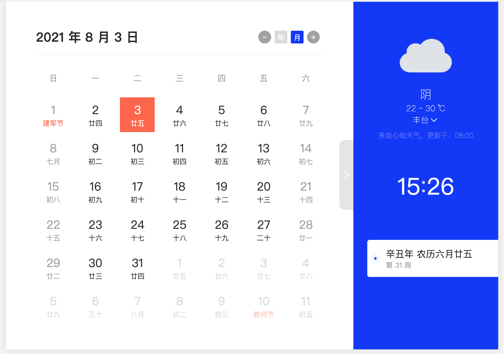

# Toy Calendar

> 一款简洁、美观、易用的日历小工具，支持公历 / 农历、节假日、多主题与天气展示。基于 Vue 3 + TypeScript + Vite。

[](https://github.com/lion1ou/calendar)
[](https://opensource.org/licenses/MIT)



**在线体验**：<https://toy.lion1ou.tech/calendar/#/>

---

## 功能特点

- 公历、农历与节气展示
- 节假日与调休标识
- 多主题与深色 / 浅色模式
- 天气信息（支持高德、和风、心知等多数据源）
- 键盘快捷键操作
- 可作为 utools 插件或独立 Web 使用

## 技术栈

- Vue 3 · TypeScript · Vite
- Vue Router · Vuex
- Tailwind CSS · Naive UI · dayjs

## 快速开始

### 环境要求

- Node.js >= 16
- npm 或 pnpm

### 安装与配置

```bash
# 克隆仓库
git clone https://github.com/lion1ou/calendar.git
cd calendar

# 安装依赖
npm install

# 配置环境变量（天气等功能需要）
cp .env.example .env
# 编辑 .env，填入各天气 API 的 Key，详见下方「配置说明」
```

### 开发与构建

```bash
# 本地开发
npm run dev

# 构建
npm run build

# 预览构建结果
npm run serve
```

## 配置说明

天气等功能依赖第三方 API，需在项目根目录创建 `.env` 或 `.env.local`（勿提交到仓库），参考 `.env.example` 填写：

| 变量名 | 说明 |
|--------|------|
| `VITE_GD_WEATHER_KEY` | 高德天气 API Key（[高德开放平台](https://lbs.amap.com/)） |
| `VITE_HF_WEATHER_KEY` | 和风天气 API Key（[和风开发平台](https://dev.qweather.com/)） |
| `VITE_XZ_WEATHER_KEY` | 心知天气 Public Key（[心知天气](https://www.seniverse.com/)） |
| `VITE_XZ_WEATHER_SECRET` | 心知天气 Secret Key（用于签名） |
| `VITE_STORAGE_KEY` | 本地存储前缀（可选，默认 `toy-calendar`） |

至少配置一种天气数据源的 Key 即可使用天气功能；未配置时天气模块会请求失败，其余功能正常。

## 键盘快捷键

| 按键 | 操作 |
|------|------|
| **Shift + ↑/↓** | 上 / 下翻一年 |
| **Shift + ←/→** | 上 / 下翻一月 |
| **↑/↓** | 上 / 下翻一周 |
| **←/→** | 上 / 下翻一天 |
| **空格 / 回车 / ESC** | 回到今天 |

## 项目结构（简要）

```
src/
├── api/          # 接口与请求
├── config/       # 配置（含环境变量读取）
├── constant/     # 常量与静态数据
├── lib/          # 第三方库（如农历）
├── store/        # Vuex
├── utils/        # 工具函数
├── views/        # 页面与组件
└── main.ts
```

## 感谢

@Jea杨 

## 贡献

欢迎通过 Issue 和 Pull Request 参与，详见 [CONTRIBUTING.md](./CONTRIBUTING.md)。


## 许可证

[MIT](./LICENSE) © lion1ou
